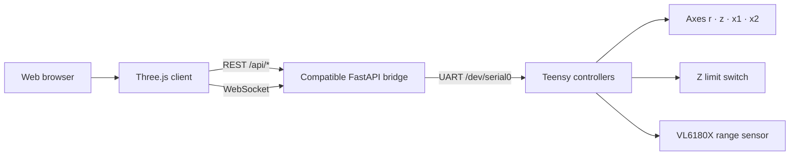

# Scanbot3000 Kinematics

A browser-based Three.js kinematics visualizer with optional local machine-control and range-sampling integration.


Scanbot3000 Kinematics renders a 3D model of the stage and scan geometry in the browser. It can run by itself for visualization, or connect to a separately maintained FastAPI bridge for live positions, coordinated motion, homing, driver controls, LEDs, scan paths, emergency stop, and VL6180X range sampling.

> The backend source and controller firmware are **not included** in this repository. Hardware and software details that cannot be verified from repository evidence are explicitly marked as unknown rather than guessed.


## 🚀 Getting started

For visualization only:

```bash
cd webapp
python -m http.server 8000
```

Open `http://localhost:8000/index.html`.

For a compatible backend on another machine, the public-ready client is intended to accept an endpoint at runtime rather than committing a machine-specific address:

```text
http://localhost:8000/index.html?api=http://<host>:8001/api
```

See the complete [setup guide](docs/SETUP.md).

## 🧩 Architecture



The browser side is static HTML/CSS/JavaScript and loads Three.js `0.157.0` from unpkg. The compatible backend described by this repository bridges HTTP/WebSocket requests to newline-delimited controller commands over `/dev/serial0` at 1,000,000 baud. See [architecture details](docs/ARCHITECTURE.md) and the [API contract](docs/API.md).

## Main capabilities

- Interactive X/Z/P/R kinematics visualization with perspective and orthographic views.
- Drag controls, axis/readout overlays, driver status/settings, homing, and emergency-stop UI.
- Coordinated quarter-circle scan-path generation with waypoints, repeats, pause/resume, stop, and dry-run mode.
- Live range sampling over the R-axis WebSocket and in-scene point-cloud rendering.
- Standalone visualization when the hardware API is offline.

## 🔒 Security model

The compatible control API is documented as unauthenticated and intended for a trusted local network. It can command physical motion and controller operations; do not expose it directly to the public internet. Read [SECURITY.md](SECURITY.md) before connecting real hardware.

## Documentation

- [Setup](docs/SETUP.md) — step-by-step local and hardware-connected setup.
- [Requirements](docs/REQUIREMENTS.md) — verified hardware/software facts, unknowns, and constraints.
- [Architecture](docs/ARCHITECTURE.md) — component boundaries and data flow.
- [API](docs/API.md) — compatible FastAPI REST/WebSocket contract.
- [Troubleshooting](docs/TROUBLESHOOTING.md) — repository-supported failure modes.
- [Prompting](docs/PROMPTING.md) — safe AI/agent prompt patterns for this project.
- [Public release checklist](docs/PUBLIC_RELEASE_CHECKLIST.md) — privacy and release checks.
- [Contributing](CONTRIBUTING.md) — contribution and public-data rules.
- [Security](SECURITY.md) — deployment and vulnerability-reporting guidance.

## Repository layout

```text
.
├── webapp/
│   ├── index.html
│   ├── styles.css
│   └── app.js
├── docs/
│   ├── API.md
│   ├── ARCHITECTURE.md
│   ├── REQUIREMENTS.md
│   ├── SETUP.md
│   ├── TROUBLESHOOTING.md
│   ├── PROMPTING.md
│   ├── PUBLIC_RELEASE_CHECKLIST.md
│   └── assets/architecture.svg
├── CONTRIBUTING.md
├── SECURITY.md
├── NOTICE
└── LICENSE
```

## License

Licensed under the Apache License 2.0 with the Commons Clause License Condition v1.0. Internal business use, modification, and redistribution are allowed under the license terms; selling the software itself or offering a product or service whose value derives substantially from this software is restricted. See [LICENSE](LICENSE).

## Release status

The `public-ready-review` branch contains the public-facing cleanup work for review. The final release gate remains the history sanitization and verification documented in [docs/PUBLIC_RELEASE_CHECKLIST.md](docs/PUBLIC_RELEASE_CHECKLIST.md); do not treat an unchecked history-cleanup item as completed.
