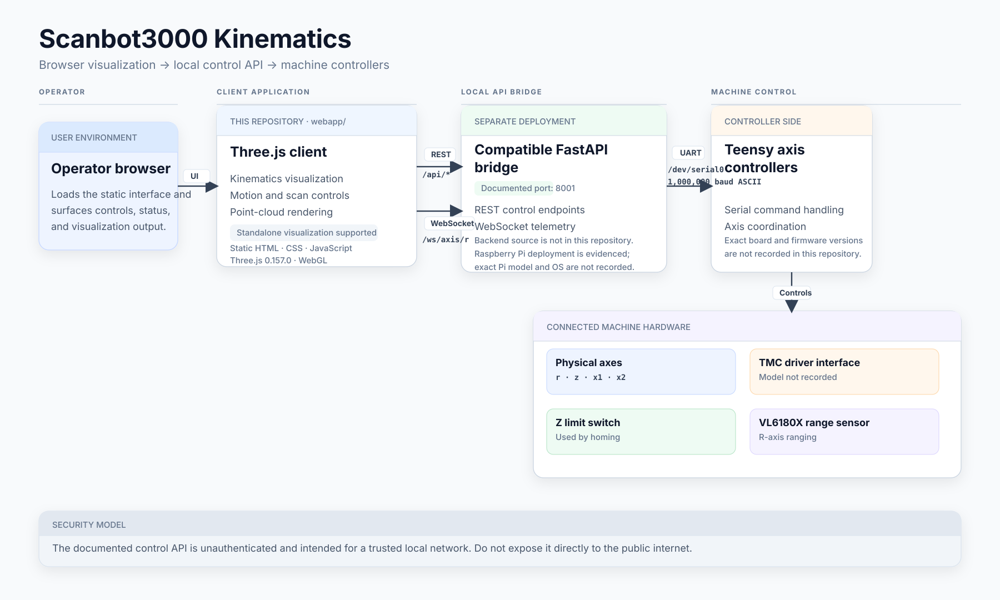
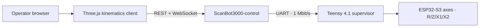

# ScanBot3000 Kinematics

Interactive Three.js visualization, scan-path planning, and browser control client for the ScanBot3000 motion system.


ScanBot3000 Kinematics renders the stage and scan geometry in the browser. It works as a standalone visualization or connects to the project FastAPI bridge for live positions, homing, coordinated motion, driver controls, LEDs, emergency stop, scan paths, and VL6180X range sampling.

> **Project home:** [Scanbot3000](https://github.com/DreamMakers2/Scanbot3000)  
> **Control server:** [ScanBot3000-control](https://github.com/DreamMakers2/ScanBot3000-control)  
> **Firmware:** [ScanBot3000-firmware](https://github.com/DreamMakers2/ScanBot3000-firmware)



## 🚀 Getting started

For visualization only:

```bash
git clone https://github.com/DreamMakers2/ScanBot3000-kinematics.git
cd ScanBot3000-kinematics/webapp
python -m http.server 8000
```

Open `http://localhost:8000/index.html`.

For live hardware control, run `ScanBot3000-control` on the Raspberry Pi and provide its API endpoint at runtime:

```text
http://localhost:8000/index.html?api=http://<host>:8001/api
```

Replace `<host>` locally; do not commit a machine-specific address. See [docs/SETUP.md](docs/SETUP.md).

## 🧩 Architecture



The browser layer is static HTML/CSS/JavaScript and loads Three.js `0.157.0` from unpkg. The project control server converts HTTP/WebSocket operations to the Teensy newline-delimited console protocol. The firmware repository owns the embedded motion behavior.

## Main capabilities

- Interactive X/Z/P/R kinematics visualization with perspective and orthographic views.
- Drag controls, overlays, driver status/settings, homing, and emergency-stop UI.
- Coordinated quarter-circle scan-path generation with waypoints, repeats, pause/resume, stop, and dry-run mode.
- Live range sampling over the R-axis WebSocket and in-scene point-cloud rendering.
- Standalone visualization when the hardware API is offline.

## Hardware relationship

This repository itself requires only a browser capable of running the static WebGL application. Live machine control uses the linked project stack:

- Raspberry Pi 4B (2 GB in the recorded control deployment).
- Teensy 4.1 motion supervisor.
- ESP32-S3 axis controllers for R, Z, X1, and X2.
- TMC2209 stepper drivers and the sensors documented by the firmware repository, including a Z limit switch and R-axis VL6180X.

See [docs/REQUIREMENTS.md](docs/REQUIREMENTS.md) for the distinction between standalone requirements, verified full-stack hardware, and unknown minimums.

## 🔒 Security model

The browser is not a safety controller. When connected, the project FastAPI bridge is unauthenticated and can command physical movement. Keep the API on a trusted local network and do not expose it directly to the public internet.

Use dry-run mode and verify real machine clearances, homing, limits, and stop behavior before executing scan paths. Read [SECURITY.md](SECURITY.md).

## Documentation

- [Setup](docs/SETUP.md) — standalone and full-stack setup.
- [Requirements](docs/REQUIREMENTS.md) — verified hardware/software and unknown minimums.
- [Architecture](docs/ARCHITECTURE.md) — repository and full-stack boundaries.
- [API](docs/API.md) — REST/WebSocket contract used by this client.
- [Troubleshooting](docs/TROUBLESHOOTING.md) — repository-supported failure modes.
- [Prompting](docs/PROMPTING.md) — safe AI/agent prompt patterns.
- [Public release checklist](docs/PUBLIC_RELEASE_CHECKLIST.md) — sanitization record.
- [Contributing](CONTRIBUTING.md) and [Security](SECURITY.md).

## Repository layout

```text
.
├── webapp/
│   ├── index.html
│   ├── styles.css
│   └── app.js
├── docs/
│   ├── API.md
│   ├── ARCHITECTURE.md
│   ├── REQUIREMENTS.md
│   ├── SETUP.md
│   ├── TROUBLESHOOTING.md
│   ├── PROMPTING.md
│   └── assets/architecture.svg
├── CONTRIBUTING.md
├── SECURITY.md
├── NOTICE
└── LICENSE
```

## License

Licensed under the Apache License 2.0 with the Commons Clause License Condition v1.0. Internal business use, modification, and redistribution are permitted under the license terms; selling the software itself or offering a product or service whose value derives substantially from the software is restricted. See [LICENSE](LICENSE).
