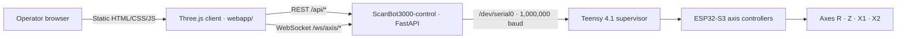

# Kinematics Architecture

`ScanBot3000-kinematics` owns the browser visualization and operator scan-path UI. It does not contain the Raspberry Pi service or embedded firmware.

## Browser client

`webapp/index.html`, `styles.css`, and `app.js` implement rendering, controls, scan paths, live overlays, and range-point visualization. Three.js `0.157.0` is loaded at runtime from unpkg.

The client can remain usable as a visualization when the backend is unavailable.

## Control bridge

The canonical backend is [ScanBot3000-control](https://github.com/DreamMakers2/ScanBot3000-control). It exposes the REST/WebSocket contract documented in `API.md` and bridges it to the Teensy serial console.

## Firmware/controller side

The canonical embedded implementation is [ScanBot3000-firmware](https://github.com/DreamMakers2/ScanBot3000-firmware). The verified project stack uses a Teensy 4.1 supervisor with ESP32-S3 axis controllers, TMC2209 drivers, a Z limit switch, and R-axis VL6180X ranging.

## Trust boundary

The control API is unauthenticated in the current implementation and intended for a trusted local network. The visualization is not a safety function and must not be used to infer guaranteed physical clearance.
