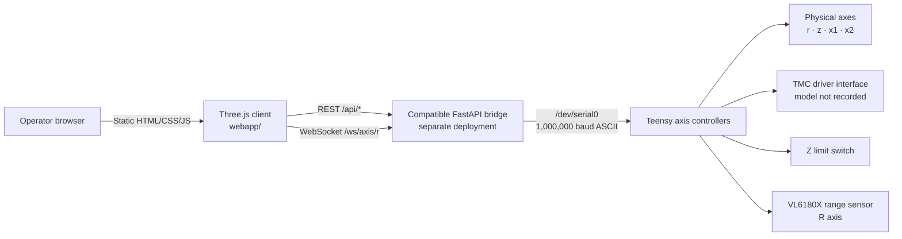

# Architecture

The repository contains a static Three.js browser client. Optional live control connects to a separately maintained FastAPI service, which bridges local-network requests to machine controllers over UART.

## Browser client

`webapp/index.html`, `styles.css`, and `app.js` implement the visualization and operator controls. Three.js `0.157.0` is loaded at runtime from unpkg. The client can remain in visualization mode when the backend is unavailable.

## API bridge

The backend source is not part of this repository. `API.md` records the compatible contract used by the client: motion, positions, homing, driver state/settings, LEDs, ranging, reboot, stop, and WebSocket telemetry.

## Controller side

Repository evidence identifies Teensy controllers, physical axes `r`, `z`, `x1`, `x2`, TMC driver commands, a Z limit switch, and VL6180X ranging. Exact board, driver, motor, power, mechanics, and firmware versions are not recorded here.

## Trust boundary

The documented compatible API is unauthenticated and intended for a trusted local network. It should not be exposed directly to the public internet.
